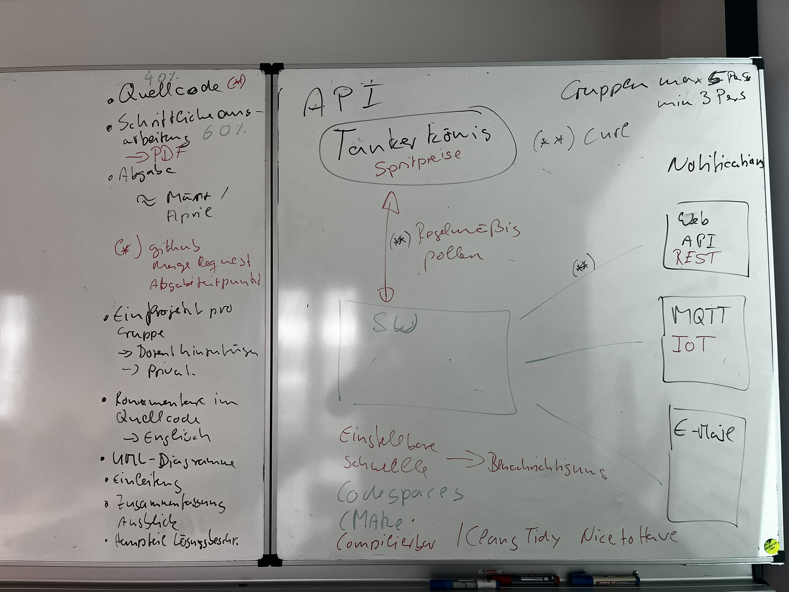

# Testat

## Aufgabenstellung

Ziel ist es eine Kommandozeilen Applikation zu entwickeln welche als persönlicher Tank Assistent verwendet werden kann. Dabei können die folgenden Aspekte von Interesse sein:

- Benachrichtigung wenn der Spritpreis am günstigsten ist
- Statistik wann es typischerweise unter der Woche am günstigsten ist
- Die im Durchschnitt günstigste Tankstelle im Umkreis von x Kilometern.
  
Für die Formatierung der Nachricht eignet sich zum Beispiel Markdown, alternativ können Sie auch eine HTML Ausgabe verwenden.

### Abfrage der Spritpreise

Die Abfrage der Spritpreise können Sie über die API der [tankerkoenig.de](https://creativecommons.tankerkoenig.de/) realisieren. Die Abfrage erfolgt in C++ mittels der Bibliothek [libcurl](https://curl.se/libcurl/).

Sie finden Beispiele zur Verwendung von `libcurl`` auf der [Projektwebseite](https://curl.se/libcurl/c/example.html).

**WICHTIG:** Bitte beachten sie die Nutzungsbedingungen der Webseite [tankerkoenig.de](https://creativecommons.tankerkoenig.de/) dort wird zum Beispiel darauf hingewiesen, dass sie die Daten nicht schneller als alle 5 Minuten abrufen sollten.

Für die Abfrage der Tankstellen können Sie den [Tankstellenfinder](https://creativecommons.tankerkoenig.de/TankstellenFinder/index.html) der Webseite [tankerkoenig.de](https://creativecommons.tankerkoenig.de/) verwenden.

#### JSON Verarbeitung

Die `JSON` Daten der API können Sie mit der integrierten JSON Bibliothek von [Niels Lohmann](https://json.nlohmann.me/features/parsing/parse_exceptions/) verarbeiten.
 
### Benachrichtigung

Wählen Sie mindestens zwei Varianten zur Benachrichtigung, hier einige Beispiele:

- REST Web Piush API
- [Microsoft Teams](https://learn.microsoft.com/de-de/adaptive-cards/resources/tools)
- E-Mail
- MQTT
- ...

**WICHTIG:** Speichern Sie niemals Passwörter oder Zugangs-Token im Quelltext, nutzen Sie hierfür Methoden wie Konfigurationsdateien oder Umgebungsvariablen beziehungsweise Kommandozeilenargumente.

## Vorbereitung

Jede Gruppe legt ein eigenes Repository an und fügt den Benutzer `graugans` zu diesem Repository hinzu. Das Repository ist auf **Privat** zu stellen. Damit die Gruppen nicht voneinander abschreiben können.

## Bewertung

### Quellcode 40%

Bewertet wird die Qualität des Quellcodes hinsichtlich der folgenden Kriterien:

- Lesbarkeit
- Niedrige Fehlerrate
- Verwendung der in der Vorlesung erlernte Konzepte

### Dokumentation 60%

Neben der Implementierung spielt die Dokumentation Ihres Projektes eine Zentrale Rolle. Dazu Gehören die folgenden Aspekte:

- Doxygen, ist nicht zwingend notwendig.
- Projektdokumentation

Die Projektdokumentation hat in **Markdown** zu erfolgen!
Zusatzpunkte können Sie erlangen wenn Sie zum Beispiel Ihre Projektdokumentation mittels [MkDocs](https://www.mkdocs.org/) und GitHub Pages zu Verfügung stellen.

### Testing

Um sicherzustellen, dass der Quellcode die erwarten Ergebnisse liefert ist ein geeignetes Test set-up zu wählen. In Ihrem Codespace stehen Ihnen dafür das Framework [Catch2](https://github.com/catchorg/Catch2) zu Verfügung. Testing ist Teil der Bewertung des Quellcodes.

### Zusatzpunkte

Generell gilt, überraschen Sie mich. Besonders kreative Ansätze und erweiterte Lösungen werden belohnt. Hier ein paar Vorschläge zum sammeln von Zusatzpunkten:

- Nutzung der GitHub Actions zum automatisierten Bauen

## Abgabe

Die Abgabe erfolgt bis spätestens 13.01.2023 um 00:00 Uhr. Über einen Pull-Request im spezifische Team Repository. Erstellen Sie hierzu einen Branch `testat-001` analog zu folgender Graphik:

Sie entwickeln Ihre Features in separaten Branches welche Sie jeweils mittels Pull-Request in Ihren Branch `testat-001` mergen.

**Wichtig:** Sie dürfen Ihren Branch `testat-001` auf keinen Fall in main mergen.

### Disqualifikation

Sollte eine oder mehrere Gruppen voneinander abschreiben, oder identischen Quellcode abliefern werden beide Gruppen disqualifiziert und das Testat gilt als nicht bestanden.
